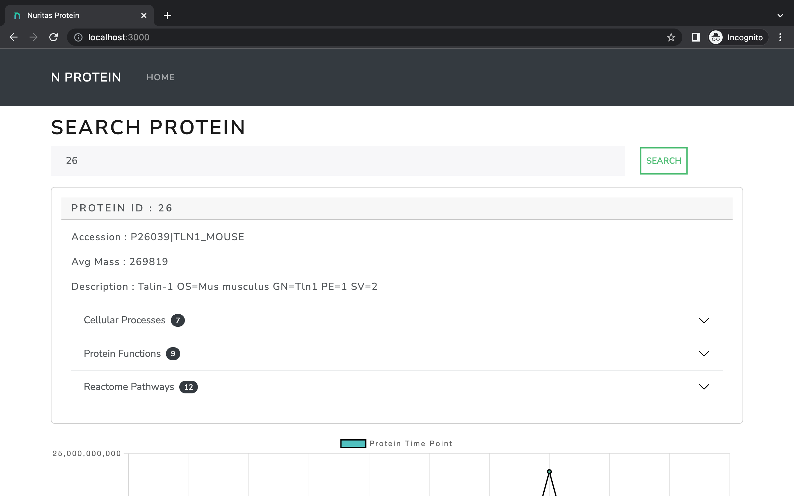

# Protein App

**Protein App** is a full-stack web app that allows users to 
get summarize detail of protein for a given protein ID and also view visualization time series of the numeric timepoint information for a given protein ID

**This app is using Django 4.1 and Python 3.9**.

[](https://github.com/nickjj/docker-django-example/blob/main/.github/docs/screenshot.jpg?raw=true)

## Table of contents

- [Tech stack](#tech-stack)
- [Packages and extensions](#packages-and-extensions)
- [Running this app](#running-this-app)

## Tech stack

### Back-end

- [PostgreSQL](https://www.postgresql.org/)
- [Django](https://www.djangoproject.com/)


### Front-end

- [React](https://reactjs.org/)
- [ReactBootstrap](https://react-bootstrap.github.io/)
- [Theme](https://bootswatch.com/)

## Packages and extensions

- **Packages and extensions**:
    - *[gunicorn](https://gunicorn.org/)* for an app server in both development and production
    - *[nginx](https://www.nginx.com/)* for serving static files
- **Linting and formatting**:
    - *[flake8](https://github.com/PyCQA/flake8)* is used to lint the code base
    - *[black](https://github.com/psf/black)* is used to format the code base

## Running this app

You'll need to have [Docker installed](https://docs.docker.com/get-docker/).
It's available on Windows, macOS and most distros of Linux. 

#### Clone this repo anywhere you want and move into the directory:

```sh
git clone https://github.com/AbdulWaheedPasha/nuritas.git
cd nuritas
```

#### Copy a few example files because the real files are git ignored:

```sh
cp .env.example .env
```

#### Build everything:

*The first time you run this it's going to take 5-10 minutes depending on your
internet connection speed and computer's hardware specs. That's because it's
going to download a few Docker images and build the Python + Yarn dependencies.*

```sh
docker-compose up --build
```

If you see `nuritas_frontend_1 exited with code 127` in terminal. It means react has 
successful build static files for production. Now that everything is built and running we can treat it like any other Django
app. 

#### Populate database:
Populate database using management command.

```sh
# You can run this from a 2nd terminal.
docker exec backend python manage.py populate_database proteins_time_course.csv
```

#### Check it out in a browser:

Visit <http://127.0.0.1> in your favorite browser.

#### Stopping everything:

```sh
# Stop the containers and remove a few Docker related resources associated to this project.
docker-compose down
```

You can start things up again with `docker-compose up` and unlike the first
time it should only take seconds.